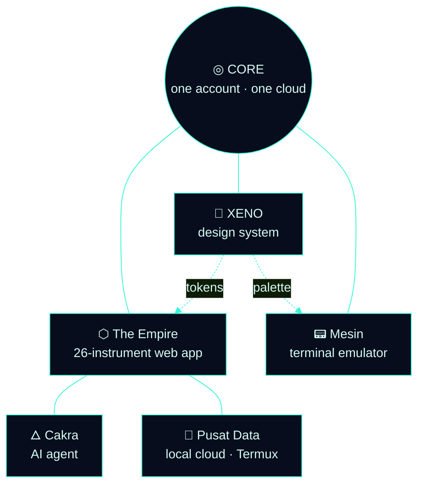

# Hi, I'm Jondri 👋

**From Indonesia 🇮🇩 — building a software empire that doesn't look like it's from here.**

---

## 🧑‍💻 About

I'm 19, based in Central Borneo, working toward a remote developer career.

I build a suite of **interconnected apps** under **JondriDev** — all sharing
**one account, one mesh, one design language**.

That design language is **XENO**: a first-contact interface. Deep-field void,
bioluminescent signals, holographic glass — futuristic, minimal, alien.

---

## 🛰️ The Ecosystem

Every node speaks the same visual language and reports to the same core. The
design system is the single source of truth — its tokens are vendored 1:1 into
**The Empire** web app and its palette into the terminal.

---

## 📦 Nodes

| Node | What it is | Stack | Status |
|------|-----------|-------|--------|
| ⬡ **[The Empire](https://github.com/JondriDev/the-empire)** | The flagship — 26 instruments in one self-contained web super-app. Finance, notes, terminal, calendar, AI tools and more, wired into one mesh; data stays on-device. | HTML · CSS · JS | **Live** |
| 🎨 **[XENO Design System](https://github.com/JondriDev/design-system)** | First-contact design language — deep-field palette, holographic glass, a living network. The source of truth for every app. | HTML · CSS · Canvas | **Live** |
| 🇮🇩 **[Aplikasi AI Indonesia](https://github.com/JondriDev/aplikasi-ai-indonesia)** | The Empire, branded for Indonesia — the same 26-instrument web super-app, bilingual EN/ID, on-device. | HTML · CSS · JS | **Live** |
| 📟 **[Mesin](https://github.com/JondriDev/mesin)** | A terminal emulator built from first principles — raw PTY via JNI, custom ANSI/VT100 state machine, Canvas cell renderer, 256-color + true color. Ships a web demo too. | Kotlin · C | **Live** |
| 🜂 **Cakra** | The in-app AI agent (OpenManus / NVIDIA NIM backend), reachable from the super-app over the local mesh. | Dart · SSE | Prototype |

> Build artifacts (APKs) ship from each repo's **Actions** tab.

---

## 🎨 XENO — the design language

- **Deep-Field palette** — a void backdrop with bioluminescent signals:
  `signal #34F5D6` · `aurora #5CF0A8` · `plasma #B06BFF` · `ion #4D9BFF` · `ember #FF9B6B`
- **Holographic glass** — near-invisible surfaces, hairline signal rims, a faint scanline texture
- **Living network** — a drifting constellation mesh behind everything; the ecosystem made literal
- **Bilingual** — English / Bahasa Indonesia · **Dark "Void" + light "Daylight Survey"**

The full system is a single self-contained page → **[open the design system](https://github.com/JondriDev/design-system)**

---

## 🛠️ Stack

---

## 📱 My Setup

> **Claude Code** + **Samsung Tab S9 FE**.

---

## 🎯 2026 Goal

Deploy the full ecosystem. Get hired remotely.

> *One account. One mesh. Many instruments.*
